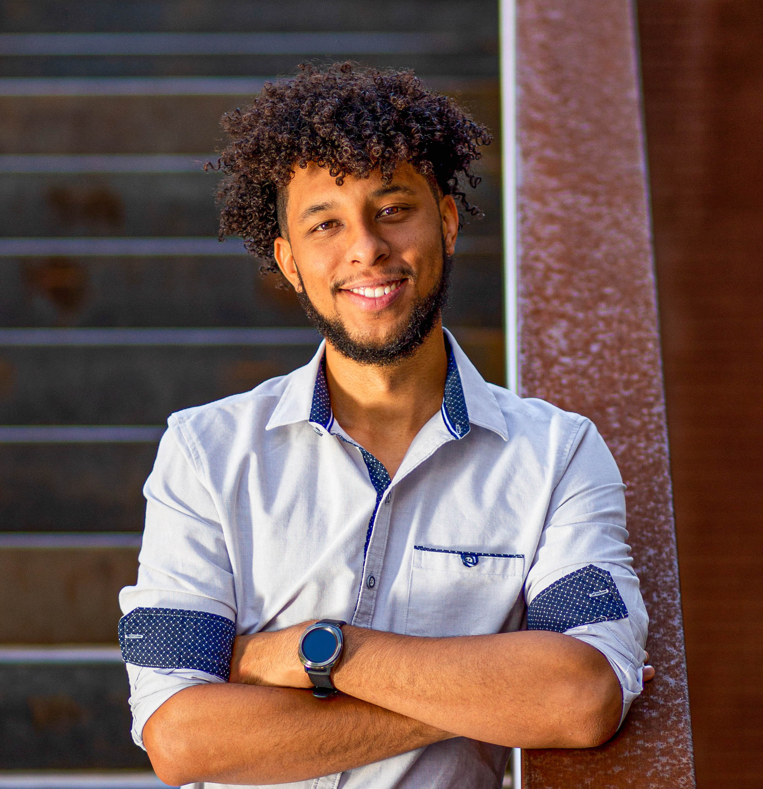
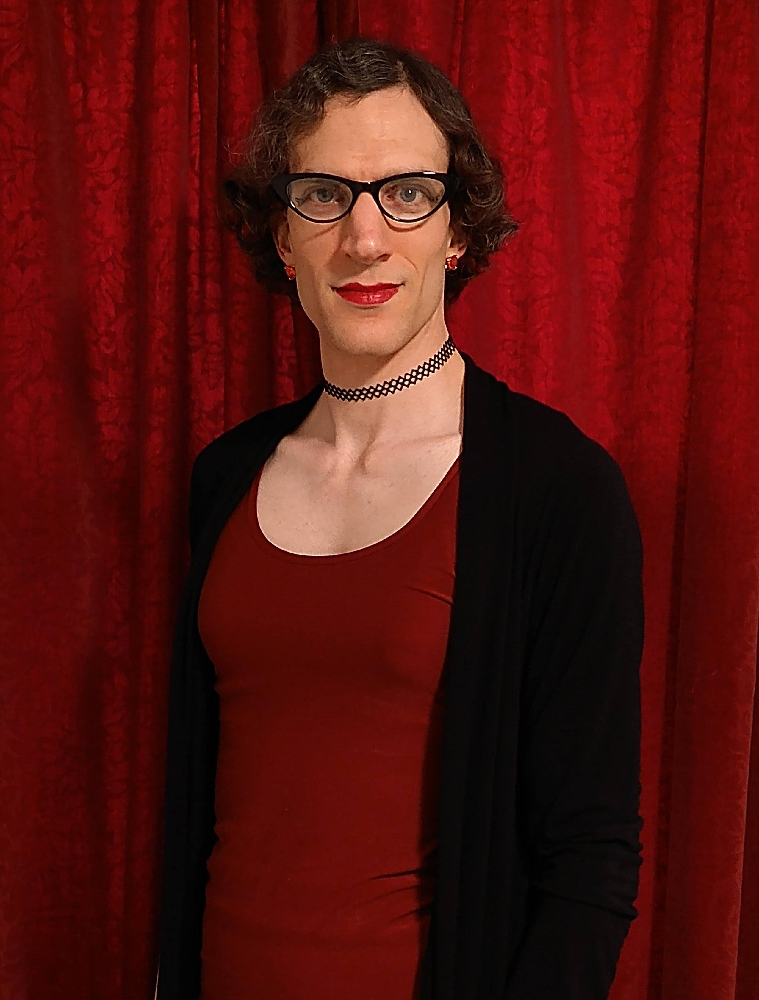
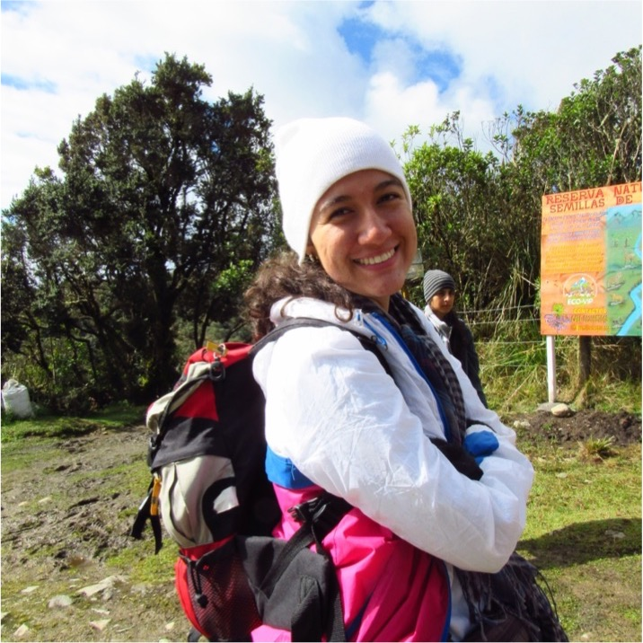
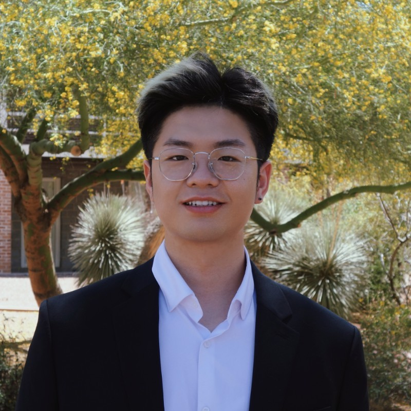

<h1 class="post-title"  style="background-color:powderblue; text-align: center; width: 450%; font-size:50px;" itemprop="headline">Current members</h1>

<!-- /.tile -->

  <h2 class="post-title"  style="background-color:lightgrey; text-align: center; width: 100%;" itemprop="headline">Cristian Román Palacios</h2>
  

       
  PI. Assistant Professor, School of Information, University of Arizona. Early Career fellow at the Center for Diverse Leadership in Science, University of California, Los Angeles. Cristian's research is focused on the intersection between evolutionary biology, climate change, and applied machine learning. He is generally interested in answering questions in Evolutionary Biology and developing methods and tools for different fields. <a href="https://cromanpa94.github.io/cromanpa//CV/">Updated CV</a>.
  

<!-- /.tile -->

  <h2 class="post-title"  style="background-color:lightgrey;  text-align: center; width: 100%;" itemprop="headline">Danielle Van Boxel</h2>
  

       
  Ph.D. student. (2022–). Danielle Van Boxel is a third year Ph.D. student in Applied Math at the University of Arizona and Senior Data Scientist with the Rincon Research Corporation. She previously worked in government for a decade generating and analyzing statistics to discover anomalies and patterns in seemingly random data. Her current research focuses on Bayesian methods in ensemble machine learning. In her free time, Danielle enjoys bird watching, tabletop RPGs, and making math puns. <a href="https://appliedmath.arizona.edu/person/danielle-van-boxel">Website</a>, <a href="https://www.youtube.com/@DanVanBoxel">YouTube</a>.
  

<!-- /.tile -->

  <h2 class="post-title"  style="background-color:lightgrey; text-align: center; width: 100%;" itemprop="headline">Kyle Arechiga</h2>
  

       
  Ms.C. Student (2022–). I am a Master’s student in the UArizona iSchool focusing on Machine Learning and AI. I have a background in electrical engineering, graduating in 2018 with a B.S. in Electrical Engineering from UArizona. I have been working full time since then as a Test Engineer. I discovered that I had a love for coding and data science in particular and wanted to dive deeper into the field which led me to going back to school for full-stack development in 2019 from UArizona online Coding Bootcamp then going for my Master’s in Information Science starting in 2021. <a href="https://www.linkedin.com/in/kyle-arechiga-007a92132">Website</a>.
  

<!-- /.tile -->

  <h2 class="post-title"  style="background-color:lightgrey; text-align: center; width: 100%;" itemprop="headline">Valentina Sarria-Rodriguez</h2>
  

       
  Bs.C. student (2018–). Valentina is a MsC student in Biological Sciences at Universidad del Valle, Colombia. She is primarily interested in the systematics of neotropical insects. Valentina was Dr. Román-Palacios' first undergraduate student. She studied the systematics of neotropical Psocidae and currently expanded her research expertise in phylogenetics into other orders within insecta.
  

<!-- /.tile -->

<!-- /.tiles -->

       

<h2 class="post-title"  style="background-color:powderblue; text-align: center; width: 450%; font-size:50px;" itemprop="headline">Past members</h2>

<!-- /.tile -->

  <h2 class="post-title"  style="background-color:lightgrey; text-align: center; width: 100%;" itemprop="headline">Wonkyun Yim</h2>
  

       
  MS Information Science (2022) – Staff Researcher at Roman's lab, Fall 2022. Wonkyun was in charge of working on a novel Machine Learning Framework to understand species-level extinctions from simulated populations. Wonkyun's primary research focuses on the use of machine learning and deep learning to identify large-scale patterns in datasets.
  

  <h1 class="post-title"  style="background-color:lightgrey; text-align: center; width: 100%;" itemprop="headline">Quan Gan</h1>
  

       
  Ms.C. Student (2022). Full stack developer at Dorabot Inc. Dorabot is a multinational startup robot solution company to design, build and deploy industrial robots for warehouse companies like DHL. I am working as a Full stack developer to implement UI applications and backend servers to interact and control industrial robot. Data Science intern and Software developer Graduate Research Assistant at iSamples.  <a href="https://www.linkedin.com/in/quan-gan-028a78172">Website</a>.
  

<!-- /.tile -->

<!-- /.tile -->

       

<h2 class="post-title"  style="background-color:powderblue; text-align: center; width: 450%; font-size:50px;" itemprop="headline">Lab photos</h2>

<!-- /.tile -->

  <h2 class="post-title"  style="background-color:lightgrey; text-align: center; width: 100%;" itemprop="headline">La Indita, Tucson, Dec 1 (2022)</h2>
  

       
  Attendees at the lab dinner organized in Fall 2022 at La Indita, Tucson, AZ.
  

<!-- /.tile -->

