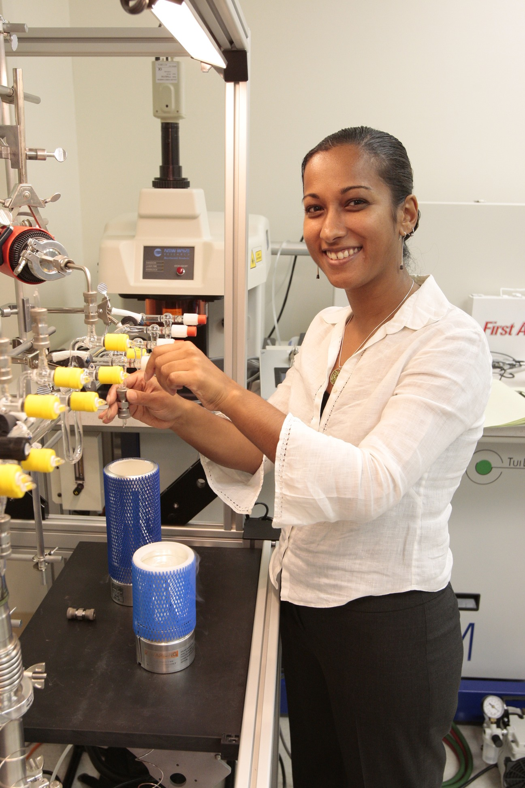
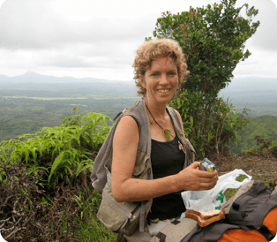
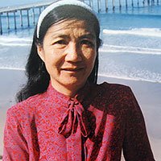
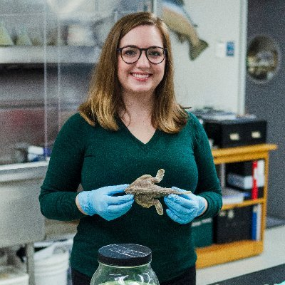
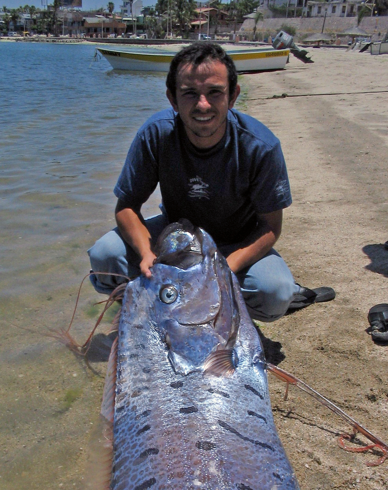
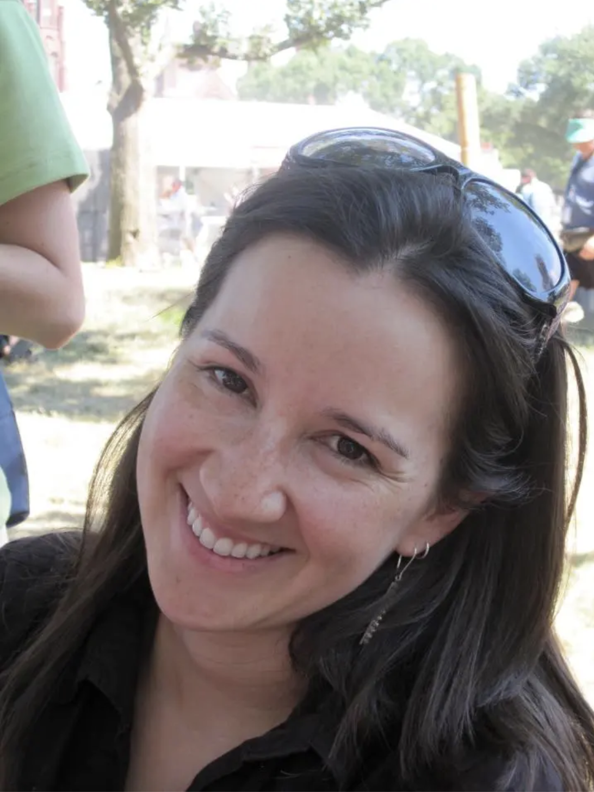
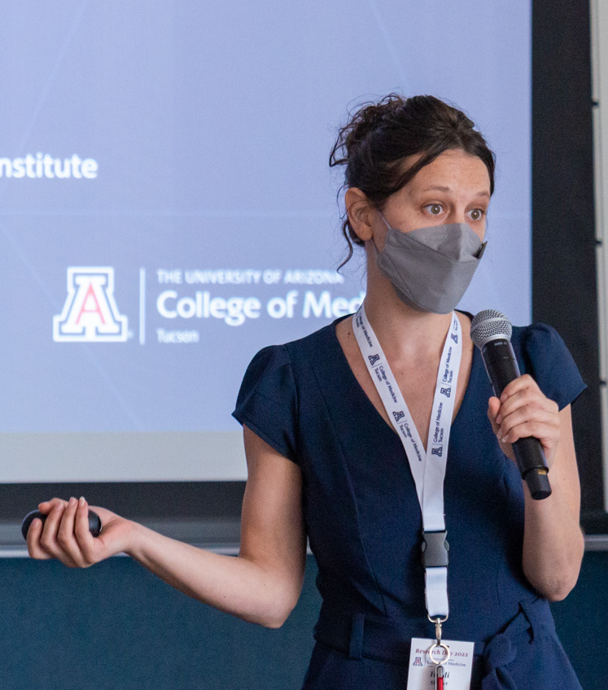
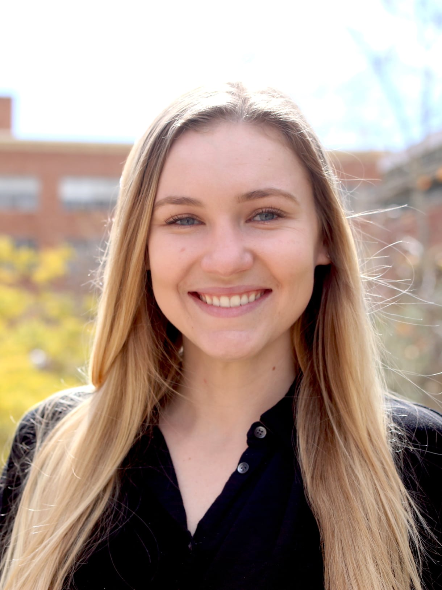

  <h2 class="post-title"  style="text-align: center; width: 100%;" itemprop="headline">Cristian Román Palacios</h2>
  

       
  Assistant Professor of Practice, School of Information, University of Arizona. Early Career fellow at the Center for Diverse Leadership in Science, University of California, Los Angeles. <a href="https://cromanpa94.github.io/cromanpa//CV/">CV</a>.
  

<!-- /.tile -->

  <h2 class="post-title"  style="text-align: center; width: 100%;" itemprop="headline">Aradhna Tripati</h2>
  

       
  Associate Professor, Center for Diverse Leadership in Science Director, IoES, Atmospheric and Oceanic Sciences, Earth, Planetary, and Space Sciences, University of California, Los Angeles. <a href="http://atripati.bol.ucla.edu/">Website</a>.
  

<!-- /.tile -->

  <h2 class="post-title"  style="text-align: center; width: 100%;" itemprop="headline">Michael S. Barker</h2>
  

       
  Associate Professor of Ecology & Evolutionary Biology, University of Arizona. <a href="https://www.barkerlab.net/">Website</a>.
  

<!-- /.tile -->

  <h2 class="post-title"  style="text-align: center; width: 100%;" itemprop="headline">Rosemary Gillespie</h2>
  

       
  Department of Environmental Science, Policy, & Management, University of California, Berkeley. <a href="https://nature.berkeley.edu/evolab/">Website</a>.
  

<!-- /.tile -->

<!-- /.tiles -->

        

  <h2 class="post-title"  style="text-align: center; width: 100%;" itemprop="headline">Lanna Cheng</h2>
  

       
  Emeritus Marine Biology Research Division, Scripps Institution of Oceanography UC San Diego. <a href="https://lcheng.scrippsprofiles.ucsd.edu/">Website</a>.
  

<!-- /.tile -->

  <h2 class="post-title"  style="text-align: center; width: 100%;" itemprop="headline">Elizabeth C. Miller</h2>
  

       
  NSF Postdoctoral Fellow at the University of Oklahoma. <a href="https://elizabethcmiller.weebly.com/">Website</a>.
  

<!-- /.tile -->

  <h2 class="post-title"  style="text-align: center; width: 100%;" itemprop="headline">Zheng Li</h2>
  

       
  Postdoctoral Fellow, The University of Texas at Austin. <a href="https://scholar.google.com/citations?user=IIbLJpsAAAAJ&hl=en">Website</a>.
  

<!-- /.tile -->

  <h2 class="post-title"  style="text-align: center; width: 100%;" itemprop="headline">Yherson Franchesco Molina Henao</h2>
  

       
  Profesor Auxiliar, Departamento de Biologia, Universidad del Valle, Colombia. <a href="https://ciencias.univalle.edu.co/departamento-de-biologia/docentes/yherson-franchesco-molina-henao">Website</a>.
  

<!-- /.tile -->

<!-- /.tiles -->

        

  <h2 class="post-title"  style="text-align: center; width: 100%;" itemprop="headline">Ranulfo Gonzalez Obando</h2>
  

       
  Profesor Titular, Departamento de Biologia, Universidad del Valle, Colombia. <a href="https://ciencias.univalle.edu.co/departamento-de-biologia/docentes/ranulfo-gonzalez">Website</a>.
  

<!-- /.tile -->

  <h2 class="post-title"  style="text-align: center; width: 100%;" itemprop="headline">Jose Tavera</h2>
  

       
  Profesor Asistente, Departamento de Biologia, Universidad del Valle, Colombia. <a href="https://taveralaben.wordpress.com/">Website</a>.
  

<!-- /.tile -->

  <h2 class="post-title"  style="text-align: center; width: 100%;" itemprop="headline">Maria del Rosario Castañeda</h2>
  

       
  Departamento de Ciencias Biológicas, Universidad Icesi, Cali. <a href="https://scholar.google.com/citations?user=BVa1pmwAAAAJ&hl=en">Website</a>.
  

<!-- /.tile -->

  <h2 class="post-title"  style="text-align: center; width: 100%;" itemprop="headline">Heidi E. Steiner</h2>
  

       
  Computation and Data Science Educator, Data Science Institute; Doctoral Candidate, College of Medicine - Tucson. <a href="https://heidiesteiner.netlify.app/">Website</a>.
  

<!-- /.tile -->

<!-- /.tiles -->

        

  <h2 class="post-title"  style="text-align: center; width: 100%;" itemprop="headline">Alexandrea Arnold</h2>
  

       
  Graduate Student, Atmospheric and Oceanic Sciences, University of California, Los Angeles. <a href="https://www.ioes.ucla.edu/person/alexandrea-arnold/">Website</a>.
  

<!-- /.tile -->

  <h2 class="post-title"  style="text-align: center; width: 100%;" itemprop="headline">Hannah Carroll</h2>
  

       
  IRACDA@UCLA postdoctoral fellow and Center for Diverse Leadership in Science Early Career Fellow. <a href="https://scholar.google.com/citations?user=rzsu0zoAAAAJ&hl=en">Website</a>.
  

<!-- /.tile -->

  <h2 class="post-title"  style="text-align: center; width: 100%;" itemprop="headline">Rob Ulrich</h2>
  

       
  Graduate Student, Earth, Planetary and Space Sciences, University of California, Los Angeles. <a href="https://www.robertnulrich.com/">Website</a>.
  

<!-- /.tile -->

  <h2 class="post-title"  style="text-align: center; width: 100%;" itemprop="headline">Wonkyun Yim</h2>
  

       
  MS Information Science (2022) – Staff Researcher at Roman's lab, Fall 2022. Project: A novel Machine Learning Framework to understand species-level extinctions from synthetic populations.
  

<!-- /.tile -->

<!-- /.tiles -->
